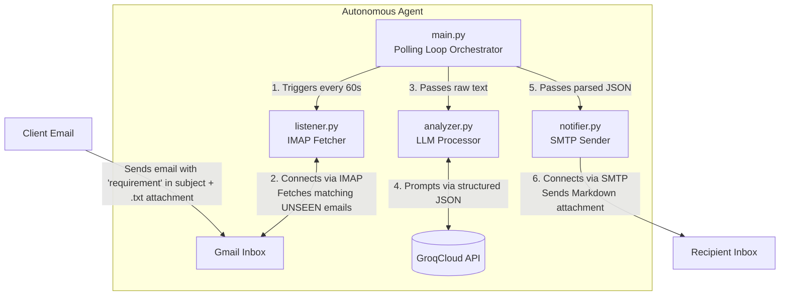

# Requirement Triage Agent

An autonomous, background-running Python agent that monitors an email inbox for client requirements, analyzes them using a Large Language Model (Groq), and automatically replies with a structured, professional Markdown triage report.

## Architecture

The system is broken down into four distinct, decoupled modules orchestrated by an infinite polling loop:



### Components

1. **`main.py`**: The entry point. Loads configuration and runs a `while True` loop, sleeping for 60 seconds between polling cycles. It routes data between the other modules and handles top-level errors.
2. **`listener.py`**: Connects securely to the Gmail inbox via IMAP. Searches for `UNSEEN` emails containing the word "requirement" in the subject. Extracts the text content from the email's attachment and marks the email as seen.
3. **`analyzer.py`**: Interacts with the GroqCloud API. Utilizes strict structured prompting to force the LLM to return valid JSON containing Functional Requirements, Non-Functional Requirements, Risks, Assumptions, and Clarifying Questions.
4. **`notifier.py`**: Transforms the JSON analysis into a clean Markdown document (`report.md`) and emails it to the configured recipient address via secure SMTP.

## Setup & Installation

1. **Clone the repository and enter the directory.**
2. **Create a virtual environment:**
   ```bash
   python3 -m venv venv
   source venv/bin/activate
   ```
3. **Install dependencies:**
   ```bash
   pip install -r requirements.txt
   ```
4. **Configure Environment Variables:**
   Create a `.env` file in the root directory and populate it with the following keys:
   ```env
   # Your Groq API key for LLM access
   GROQ_API_KEY=your_groq_api_key

   # IMAP/SMTP credentials
   SENDER_EMAIL=your.agent.email@gmail.com
   # 16-character Google App Password (NOT your normal password)
   GMAIL_APP_PASSWORD=your_app_password

   # Who receives the generated triage reports
   RECEIVER_EMAIL=recipient.email@example.com
   ```

## Usage

To start the agent in the foreground, run:
```bash
python3 main.py
```

The agent will output log messages indicating its status. To trigger it:
1. Send an email to the `SENDER_EMAIL` address.
2. Ensure the subject line contains the word **requirement** (case-insensitive).
3. Attach a text file (`.txt`) containing the raw project requirements.
4. Within 60 seconds, the agent will detect it, process it, and send a structured Markdown report to the `RECEIVER_EMAIL`.
